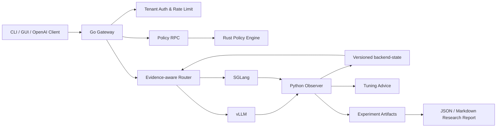
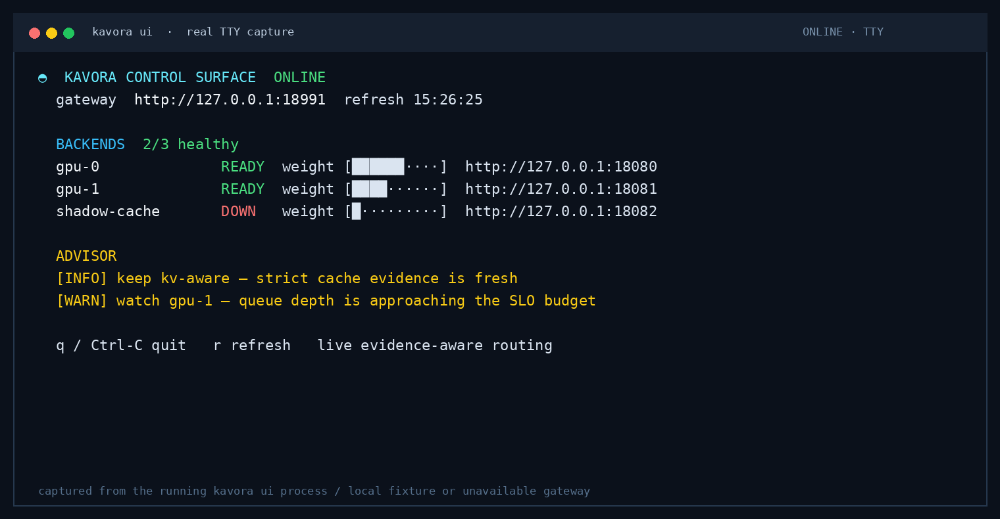
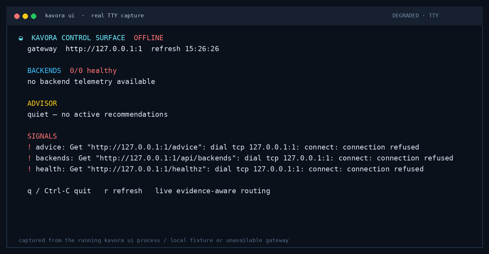
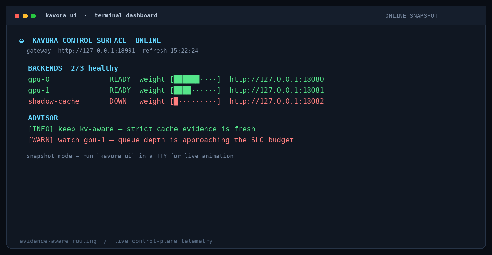

# Kavora

[English](README.md) | [简体中文](README.zh-CN.md)

> **Route by evidence. Govern by policy. Explain every placement.**


[](https://github.com/BokaiGuo/Kavora/actions/workflows/ci.yml)

Kavora is an open-source **evidence-aware AI inference control plane** for local and private LLM serving. It turns cache fidelity, state freshness, tenant constraints, and latency objectives into an inspectable backend decision rather than hiding placement behind a heuristic.

It combines three deliberately separated layers:

- **Go** — OpenAI-compatible Gateway, tenant controls, routing, streaming, CLI, and GUI.
- **Rust** — PII/content policy, incremental JSON/SSE inspection, token budgets, cache keys, and Wasmtime execution.
- **Python** — vLLM/SGLang metric normalization, backend state, tuning advice, reproducible experiments, and reports.

The name **Kavora** combines **KV**—KV cache, prefix reuse, and inference runtime state—with **Agora**—a shared control space where requests, models, policies, metrics, and tools are governed.

## Contents

- [Overview](#overview)
- [Architecture](#architecture)
- [Features](#features)
- [Quick Start](#quick-start)
- [Operations](#operations)
- [Research Workflow](#research-workflow)
- [Development](#development)
- [Project Status](#project-status)
- [Documentation](#documentation)
- [Contributing](#contributing)
- [Security](#security)

## Overview

Kavora is designed to be useful in three contexts:

| Context | Outcome |
|---|---|
| **Engineering showcase** | A visible Go/Rust boundary, GUI/CLI, streaming policy enforcement, and failure demonstrations. |
| **Local operations** | Continuous monitoring, quality-aware state, tuning advice, health checks, failover, and safe routing. |
| **Research** | Reproducible workloads, strategy comparisons, replay artifacts, promotion gates, and paper-style reports. |

See [`docs/three_goals.md`](docs/three_goals.md) for the product acceptance criteria. The project is currently **alpha**: the end-to-end control plane is implemented and tested, while performance claims remain evidence-bound.

## Architecture



### Request path

1. Client sends an OpenAI-compatible request to the Go Gateway.
2. Go authenticates the tenant, applies limits and assigns a request ID.
3. Rust evaluates JSON, PII, content, token budget and cache-key policy.
4. Router hard-filters tenant constraints, then scores cache evidence, queue/KV pressure, confidence, predicted TTFT, and SLO risk.
5. Gateway preserves unary/SSE semantics and records metrics/audit events.
6. Python Observer turns backend metrics into quality-aware state and tuning advice.

## Features

- OpenAI-compatible unary and SSE chat completions.
- Tenant authentication, concurrency limits, token budgets, and policy fail modes.
- Rust policy evaluation over Unix Socket or gRPC.
- Incremental JSON and SSE inspection with bounded streaming buffers.
- PII and content filtering before backend dispatch and during streaming responses.
- Backend health checks, model matching, weighted candidates, and failover.
- Pluggable cache fidelity: none, affinity, shadow index, and exact KV events.
- Constraint-first, SLO-aware routing with confidence decay and stale/missing fallback.
- Bounded decision ledger, admin API, lifecycle gates, deterministic canaries, and GUI Decision Inspector.
- Prometheus metrics, JSON audit events, request IDs, and an embedded GUI.
- Versioned backend-state snapshots and persistent tuning advice.
- Digest-verified Wasmtime execution with resource and capability controls.
- Reproducible benchmarks, replay artifacts, promotion gates, and Markdown/JSON reports.
- Semantic evidence alignment, automatic SLO threshold/concurrency calibration, and anonymous pre-canary workload replay.
- Outcome-grounded routing with realized request results, prediction error, durable journals, fitted explainable TTFT predictors, drift gates, native vLLM KV-event recovery, and multi-policy replay.
- Experiment-driven control with vLLM request/block-hash alignment, switchback and isolated-pool assignment, outcome-linked experiment metadata, window-cluster confidence intervals, workload-stratified policy evaluation, and causal promotion gates.

See [`docs/stage4_evidence_aware_routing.md`](docs/stage4_evidence_aware_routing.md) for the cache-evidence contract, decision API, lifecycle configuration, and fidelity/lag ablation.
See [`docs/stage5_self_tuning.md`](docs/stage5_self_tuning.md) for semantic alignment, automatic calibration, anonymous replay, human approval, and rollback.
See [`docs/stage6_outcome_grounded_control.md`](docs/stage6_outcome_grounded_control.md) for decision/outcome journals, predictor fitting, native KV events, prediction calibration, and policy laboratory semantics.

See [`docs/stage7_causal_policy_evaluation.md`](docs/stage7_causal_policy_evaluation.md) for exact vLLM hash alignment, online experiment assignment, policy-effect reports, held-out predictor validation, and lifecycle promotion gates.

## Quick Start

### One-command showcase

The showcase starts a deterministic fake backend, Rust Policy Engine and Go Gateway, then demonstrates CLI unary chat, SSE streaming, backend status and PII rejection:

```bash
make demo-kavora
```

The command generates:

```text
results/demo/showcase.json
```

It prints the temporary GUI URL. The normal GUI entry is:

```text
http://127.0.0.1:18000/ui/
```

### CLI

```bash
build/kavora doctor
build/kavora backends
build/kavora chat --message "Explain the Kavora request path"
build/kavora advice
# Live terminal dashboard with animated refresh (q to quit, r to refresh)
build/kavora ui
# One non-interactive snapshot for CI/logs
build/kavora ui --once --no-color
```

`kavora ui` is a terminal control surface: it polls gateway health, backend readiness, and tuning advice concurrently, then renders a compact animated dashboard. Use `--no-color` or `--json --once` for scripts and CI; the existing commands and JSON contracts are unchanged.

#### CLI dashboard

The dashboard is designed for a live terminal: healthy and degraded backends remain visible, advisor signals are color-coded, and the refresh frame gives the control plane a lightweight sense of motion without hiding evidence.





These two screenshots are captured from the running `kavora ui` process through a real pseudo-terminal: the online view uses local fixture endpoints and the degraded view uses an unavailable gateway. No credentials or production traffic are included.



The concept image above is retained as a visual direction reference; it is not a runtime capture.

### Build everything

```bash
make build
```

## Run With vLLM or SGLang

See [`docs/quickstart_gateway.md`](docs/quickstart_gateway.md) for complete setup.

Typical Gateway configuration uses:

```yaml
backends:
  - id: local-vllm
    url: http://127.0.0.1:8000
    models: [kvcache-local-tiny]
    health_path: /health
```

Run a real backend smoke test:

```bash
KAVORA_API_KEY=replace-with-your-key \
KAVORA_SMOKE_MODEL=kvcache-local-tiny \
KAVORA_SMOKE_REQUIRED=true \
make smoke-vllm
```

The same flow is available for SGLang with `make smoke-sglang`.

## Long-Running Monitoring

Start the Observer alongside the local inference server:

```bash
KVCACHE_BACKEND_METRICS_URL=http://127.0.0.1:8000/metrics \
KVCACHE_MODEL_NAME=kvcache-local-tiny \
KVCACHE_STATE_DIR=results/kavora-state \
python3 -m exporter.app
```

Live endpoints:

```bash
curl http://127.0.0.1:9108/backend-state
curl http://127.0.0.1:9108/advice
```

Persistent outputs:

```text
results/kavora-state/backend-state.json
results/kavora-state/advice.jsonl
```

The Observer preserves `fresh`, `stale`, `missing` and `invalid` quality. Missing metrics are never silently converted into zero.

## Research Experiments

### Stage 1 Gateway benchmark

```bash
make benchmark-stage1
```

### Stage 2 KV-aware matrix

Create a real-endpoint config from the checked-in template:

```bash
cp benchmark/config.stage2.template.yaml benchmark/config.stage2.yaml
# Edit model/revision, backend version, five target endpoints, and two metrics endpoints.
make benchmark-stage2-config
```

Run the complete matrix:

```bash
make benchmark-stage2
```

The Stage 2 command intentionally refuses to invent proxy performance rows. It requires `direct`, `static`, `load-aware`, `kv-aware-shadow`, and `kv-aware-enforced` endpoints, at least two backend metrics endpoints, four controlled workloads, and at least ten repetitions. See [`docs/stage2_results.md`](docs/stage2_results.md).

For a local model that fits as two replicas on the available GPU, run the complete stack and matrix with one command:

```bash
MODEL=/absolute/path/to/local-model make stage2-local
```

This starts two vLLM replicas, two Observers, one Rust Policy Engine, and four independently configured Gateway processes. It polls live queue/KV state during the run and tears the stack down afterward.

### Paper-style report

```bash
make research-report
```

### Calibrate and replay before canary

```bash
make auto-calibrate INPUT=results/capacity_sweeps/local/summary.json
build/kavora replay benchmark/workload_trace.example.jsonl \
  --policy candidate \
  --min-hit-ratio 0.40 \
  --max-concurrency 16 \
  --evidence-quality strict
```

Kavora does not automatically edit production configuration. A candidate must pass experiment and replay gates, receive explicit human approval, and then progress through the configured canary lifecycle.

Generated artifacts:

```text
results/research/research_report.json
results/research/research_report.md
results/research/reproduction_manifest.json
```

The report records Git revision, hardware, Python version, seed, config hashes, baselines, latency/throughput metrics and limitations. It separates real measurements, proxy measurements, smoke evidence and blocked evidence.

## Go/Rust Boundary

| Component | Language | Responsibility | Boundary |
|---|---|---|---|
| `kavora-gateway` | Go | Gateway, tenants, routing, streaming, observability | HTTP/OpenAI API |
| `kavora-policy` | Rust | Policy, JSON/SSE checks, budgets, cache keys | protobuf over Unix Socket/gRPC |
| `kavora-tool-worker` | Rust | Digest-verified Wasmtime execution | JSONL process boundary |
| `exporter` | Python | Metrics normalization, state, advice | Prometheus + JSON state |
| `benchmark` | Python | Reproducible workload and reports | JSON/Markdown artifacts |

This is not an artificial mixed-language demo: each language owns a real engineering boundary.

## Repository Layout

```text
gateway/          Go Gateway, CLI, backend registry, router, GUI
policy-engine/    Rust Policy Engine and Wasmtime worker
proto/            Versioned protobuf contracts and golden fixtures
exporter/         vLLM/SGLang metrics, state and advice
benchmark/        Gateway/KV-aware experiments and research reports
planner/          Capacity and recommendation logic
scripts/          Build, demo, smoke, gate and report entrypoints
docs/             Architecture, quickstarts, methods and limitations
tests/            Python contract, benchmark and quality tests
```

## Verification

The current project gate includes:

```bash
python3 -m pytest -q
go test -race ./gateway/...
go vet ./...
cargo test --manifest-path policy-engine/Cargo.toml
cargo clippy --manifest-path policy-engine/Cargo.toml --all-targets -- -D warnings
bash scripts/generate_proto.sh --check
make build
```

The CI badge is the source of truth for the current automated gate. Local release validation additionally runs Go race/vet, Rust test/clippy, protobuf consistency, cross-language UDS integration, and full builds.

## Documentation

- [`docs/three_goals.md`](docs/three_goals.md) — three product goals and acceptance criteria
- [`docs/project_overview.md`](docs/project_overview.md) — architecture and scope
- [`docs/quickstart_gateway.md`](docs/quickstart_gateway.md) — Gateway, vLLM/SGLang and monitoring setup
- [`docs/staged_goals.md`](docs/staged_goals.md) — staged implementation goals
- [`docs/stage1_benchmark.md`](docs/stage1_benchmark.md) — Stage 1 benchmark protocol
- [`docs/stage2_results.md`](docs/stage2_results.md) — KV-aware routing experiment
- [`docs/tool_manifest.md`](docs/tool_manifest.md) — secure tool contract
- [`docs/project_status.md`](docs/project_status.md) — delivered capabilities and claim boundaries

## Status

Kavora is an actively developed alpha. The end-to-end control plane, monitoring/advice loop, showcase demo and reproducible research report pipeline are implemented. Performance claims remain evidence-bound: the system reports what was measured and does not turn a smoke test into a throughput claim.

## Contributing

Contributions are welcome. Please keep changes focused, preserve the Go/Rust protocol contracts, add tests for behavior changes, and update the relevant benchmark or documentation artifact when changing observable behavior.

Before opening a pull request, run:

```bash
python3 -m pytest -q
go test -race ./gateway/...
cargo test --manifest-path policy-engine/Cargo.toml
```

## Security

Do not include real API keys, private model paths, customer prompts, or production traces in issues or pull requests. Review [`docs/tool_manifest.md`](docs/tool_manifest.md) and [`docs/project_status.md`](docs/project_status.md) before enabling experimental tool execution or enforced routing.
