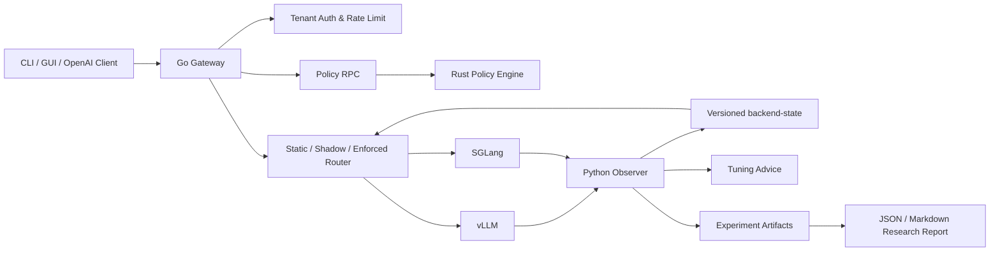

# Kavora

> **Route intelligently. Govern safely. Remember efficiently.**

Kavora 是一个面向本地和私有化大模型推理服务的 **AI Inference Control Plane**。
它把 Go 的工程效率、Rust 的性能与安全、Python 的观测与实验能力组合成一个真正可运行的系统：

- **Go**：OpenAI-compatible Gateway、租户、限流、健康检查、负载均衡、CLI 与 GUI
- **Rust**：PII/内容策略、JSON/SSE 增量解析、Token budget、cache key、Wasmtime worker
- **Python**：vLLM/SGLang 指标归一化、backend-state、调优建议、可复现实验与论文式报告

Kavora 的名字来自 **KV + Agora**：KV 代表 KV cache、prefix reuse 和推理运行时状态；Agora 代表请求、模型、策略、指标和工具汇聚并接受治理的基础设施中心。

## Why Kavora?

Kavora 不只是一个 Gateway Demo，也不只是一个 KV Cache Exporter。它同时服务三个目标：

| 目标 | Kavora 提供的能力 |
|---|---|
| **求职展示** | GUI/CLI、真实 Go/Rust 边界、Unix Socket/gRPC、流式策略、故障演示 |
| **真实可用** | 长期监控 vLLM/SGLang、backend-state、调优建议、安全路由与 static fallback |
| **研究实验** | 固定 seed/config/model/hardware、策略矩阵、replay、promotion gate、论文式报告 |

详细验收标准见 [`docs/three_goals.md`](docs/three_goals.md)。

## Architecture



### Request path

1. Client sends an OpenAI-compatible request to the Go Gateway.
2. Go authenticates the tenant, applies limits and assigns a request ID.
3. Rust evaluates JSON, PII, content, token budget and cache-key policy.
4. Router selects a healthy backend using static, shadow or enforced mode.
5. Gateway preserves unary/SSE semantics and records metrics/audit events.
6. Python Observer turns backend metrics into quality-aware state and tuning advice.

## 10-Minute Showcase

### One-command demo

The showcase starts a deterministic fake backend, Rust Policy Engine and Go Gateway, then demonstrates CLI unary chat, SSE streaming, backend status and PII rejection:

```bash
make demo-kavora
```

The command generates:

```text
results/demo/showcase.json
```

It prints the temporary GUI URL. The normal GUI entry is:

```text
http://127.0.0.1:18000/ui/
```

### CLI

```bash
build/kavora doctor
build/kavora backends
build/kavora chat --message "Explain the Kavora request path"
build/kavora advice
```

### Build everything

```bash
make build
```

## Run With vLLM or SGLang

See [`docs/quickstart_gateway.md`](docs/quickstart_gateway.md) for complete setup.

Typical Gateway configuration uses:

```yaml
backends:
  - id: local-vllm
    url: http://127.0.0.1:8000
    models: [kvcache-local-tiny]
    health_path: /health
```

Run a real backend smoke test:

```bash
KAVORA_API_KEY=replace-with-your-key \
KAVORA_SMOKE_MODEL=kvcache-local-tiny \
KAVORA_SMOKE_REQUIRED=true \
make smoke-vllm
```

The same flow is available for SGLang with `make smoke-sglang`.

## Long-Running Monitoring

Start the Observer alongside the local inference server:

```bash
KVCACHE_BACKEND_METRICS_URL=http://127.0.0.1:8000/metrics \
KVCACHE_MODEL_NAME=kvcache-local-tiny \
KVCACHE_STATE_DIR=results/kavora-state \
python3 -m exporter.app
```

Live endpoints:

```bash
curl http://127.0.0.1:9108/backend-state
curl http://127.0.0.1:9108/advice
```

Persistent outputs:

```text
results/kavora-state/backend-state.json
results/kavora-state/advice.jsonl
```

The Observer preserves `fresh`, `stale`, `missing` and `invalid` quality. Missing metrics are never silently converted into zero.

## Research Experiments

### Stage 1 Gateway benchmark

```bash
make benchmark-stage1
```

### Stage 2 KV-aware matrix

Proxy matrix:

```bash
make benchmark-stage2
```

Real backend matrix:

```bash
KAVORA_API_KEY=local-real-key \
KAVORA_STAGE2_MODEL=kvcache-local-real \
KAVORA_STAGE2_REAL_PATHS='direct=http://127.0.0.1:18080 gateway=http://127.0.0.1:18000 gateway_stream=http://127.0.0.1:18000' \
make benchmark-stage2
```

### Paper-style report

```bash
make research-report
```

Generated artifacts:

```text
results/research/research_report.json
results/research/research_report.md
results/research/reproduction_manifest.json
```

The report records Git revision, hardware, Python version, seed, config hashes, baselines, latency/throughput metrics and limitations. It separates real measurements, proxy measurements, smoke evidence and blocked evidence.

## Go/Rust Boundary

| Component | Language | Responsibility | Boundary |
|---|---|---|---|
| `kavora-gateway` | Go | Gateway, tenants, routing, streaming, observability | HTTP/OpenAI API |
| `kavora-policy` | Rust | Policy, JSON/SSE checks, budgets, cache keys | protobuf over Unix Socket/gRPC |
| `kavora-tool-worker` | Rust | Digest-verified Wasmtime execution | JSONL process boundary |
| `exporter` | Python | Metrics normalization, state, advice | Prometheus + JSON state |
| `benchmark` | Python | Reproducible workload and reports | JSON/Markdown artifacts |

This is not an artificial mixed-language demo: each language owns a real engineering boundary.

## Repository Layout

```text
gateway/          Go Gateway, CLI, backend registry, router, GUI
policy-engine/    Rust Policy Engine and Wasmtime worker
proto/            Versioned protobuf contracts and golden fixtures
exporter/         vLLM/SGLang metrics, state and advice
benchmark/        Gateway/KV-aware experiments and research reports
planner/          Capacity and recommendation logic
scripts/          Build, demo, smoke, gate and report entrypoints
docs/             Architecture, quickstarts, methods and limitations
tests/            Python contract, benchmark and quality tests
```

## Verification

The current project gate includes:

```bash
python3 -m pytest -q
go test -race ./gateway/...
go vet ./...
cargo test --manifest-path policy-engine/Cargo.toml
cargo clippy --manifest-path policy-engine/Cargo.toml --all-targets -- -D warnings
bash scripts/generate_proto.sh --check
make build
```

The latest local validation passed with **66 Python tests**, Go race/vet, Rust test/clippy, protobuf consistency and full builds.

## Documentation

- [`docs/three_goals.md`](docs/three_goals.md) — three product goals and acceptance criteria
- [`docs/project_overview.md`](docs/project_overview.md) — architecture and scope
- [`docs/quickstart_gateway.md`](docs/quickstart_gateway.md) — Gateway, vLLM/SGLang and monitoring setup
- [`docs/staged_goals.md`](docs/staged_goals.md) — staged implementation goals
- [`docs/stage1_benchmark.md`](docs/stage1_benchmark.md) — Stage 1 benchmark protocol
- [`docs/stage2_results.md`](docs/stage2_results.md) — KV-aware routing experiment
- [`docs/tool_manifest.md`](docs/tool_manifest.md) — secure tool contract
- [`docs/project_status.md`](docs/project_status.md) — delivered capabilities and claim boundaries

## Status

Kavora is an actively developed alpha. The end-to-end control plane, monitoring/advice loop, showcase demo and reproducible research report pipeline are implemented. Performance claims remain evidence-bound: the system reports what was measured and does not turn a smoke test into a throughput claim.
