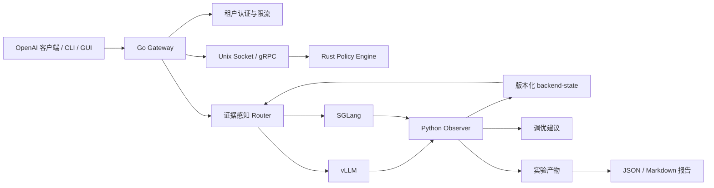

# Kavora

[English](README.md) | [简体中文](README.zh-CN.md)

**面向本地与私有化大模型推理服务的双语言 AI 推理控制平面。**

> **按证据路由，按策略治理，解释每次放置。**


[](https://github.com/BokaiGuo/Kavora/actions/workflows/ci.yml)

Kavora 将 Go 网关、Rust 策略与安全运行时，以及 Python 可观测与实验层组合成一个可运行的**证据感知 AI serving 控制平面**。它把缓存证据精度、状态新鲜度、租户硬约束与延迟目标转化为可检查的后端决策，而不是隐藏在单一启发式规则里。

- **Go**：OpenAI-compatible Gateway、租户控制、路由、流式传输、CLI 与 GUI
- **Rust**：PII/内容策略、JSON/SSE 增量检查、Token budget、cache key 与 Wasmtime 执行
- **Python**：vLLM/SGLang 指标归一化、backend-state、调优建议、可复现实验与研究报告

Kavora 的名字来自 **KV + Agora**：KV 代表 KV cache、prefix reuse 与推理运行时状态；Agora 代表请求、模型、策略、指标和工具共同汇聚并接受治理的控制空间。

## 项目定位

Kavora 同时服务三个场景：

| 场景 | 目标结果 |
| --- | --- |
| **求职展示** | 展示真实的 Go/Rust 分工、GUI/CLI、流式策略、跨语言通信和故障演示。 |
| **真实可用** | 持续监控本地推理服务，生成质量感知的 backend-state 和调优建议，并支持安全路由。 |
| **研究实验** | 固定模型、硬件、配置和 seed，比较不同策略，保存 replay 与 promotion gate，生成论文式报告。 |

详细验收标准见 [`docs/three_goals.md`](docs/three_goals.md)。项目当前处于 **alpha** 阶段：核心端到端控制平面已经实现并验证，性能结论严格依赖真实实验数据。

## 系统架构



### 请求路径

1. 客户端向 Go Gateway 发送 OpenAI-compatible 请求。
2. Go 完成租户认证、限流并生成 request ID。
3. Rust 执行 JSON、PII、内容、Token budget 和 cache-key 策略。
4. Router 先硬过滤租户约束，再综合缓存证据、队列/KV 压力、置信度、预测 TTFT 与 SLO 风险。
5. Gateway 保持 unary/SSE 语义并记录指标与审计事件。
6. Python Observer 将后端指标转换为带质量语义的状态和调优建议。

## 核心能力

- OpenAI-compatible unary 与 SSE chat completions。
- 租户认证、并发限制、Token budget 和 policy fail-open/fail-closed。
- 通过 Unix Socket 或 gRPC 调用 Rust Policy Engine。
- 有界的 JSON/SSE 增量检查，支持流式响应中的策略拒绝。
- 后端健康检查、模型匹配、加权候选和 failover。
- 可插拔缓存精度：none、affinity、shadow index 与 exact KV events。
- 约束优先、SLO-aware 路由，以及置信度衰减和 stale/missing fallback。
- 有界决策账本、管理 API、生命周期门禁、确定性 canary 与 GUI Decision Inspector。
- Prometheus 指标、JSON 审计事件、request ID 和内嵌控制台 GUI。
- 保留 `fresh`、`stale`、`missing`、`invalid` 的版本化 backend-state。
- `/advice`、`backend-state.json` 和 `advice.jsonl` 持久化调优建议。
- 带 digest、内存、实例、table、fuel、timeout 和 capability 限制的 Wasmtime worker。
- 可复现 benchmark、replay、promotion gate 以及 JSON/Markdown 报告。
- 指标语义对齐、SLO 自动阈值/并发校准，以及匿名 workload 的 canary 前回放。
- 结果闭环：真实 TTFT/E2E/状态/token/cache outcome、prediction error、持久化 JSONL、可解释预测器拟合、漂移门禁、原生 vLLM KV-event 恢复和多策略回放。
- 因果实验控制：vLLM 请求/block hash 对齐、switchback 与隔离后端池分配、实验账本、按窗口 bootstrap CI、workload 分层评估和 promotion gate。

缓存证据契约、决策 API、生命周期配置与 fidelity/lag 消融见 [`docs/stage4_evidence_aware_routing.md`](docs/stage4_evidence_aware_routing.md)。
指标真值、自动校准、匿名回放、人工审批与回滚见 [`docs/stage5_self_tuning.md`](docs/stage5_self_tuning.md)。
决策结果账本、预测器校准、原生 KV events、prediction quality 与 policy laboratory 见 [`docs/stage6_outcome_grounded_control.md`](docs/stage6_outcome_grounded_control.md)。

在线实验分配、因果 policy evaluation、exact hash alignment 和 held-out predictor validation 见 [`docs/stage7_causal_policy_evaluation.md`](docs/stage7_causal_policy_evaluation.md)。

## 快速开始

### 环境要求

- Linux 或 macOS
- Go、Rust/Cargo、Python 3.11+
- `protoc` 及仓库所需 protobuf 插件
- 真实运行需要 vLLM 或 SGLang；展示 Demo 使用确定性的 Fake Backend

```bash
make check-env
make build
```

### 一键展示 Demo

该命令会启动 Fake Backend、Rust Policy Engine 和 Go Gateway，演示 CLI unary、SSE streaming、后端状态和 PII 拒绝：

```bash
make demo-kavora
```

产物：

```text
results/demo/showcase.json
```

CLI 示例：

```bash
build/kavora doctor
build/kavora backends
build/kavora chat --message "解释 Kavora 的请求路径"
build/kavora advice
# 带动画刷新的终端控制台（q 退出，r 立即刷新）
build/kavora ui
# CI/日志使用一次性无颜色快照
build/kavora ui --once --no-color
```

`kavora ui` 是终端控制台，会并发读取 Gateway 健康状态、后端就绪状态和调优建议，并以紧凑动画面板持续刷新。脚本或 CI 可使用 `--no-color` 或 `--json --once`；原有命令和 JSON 契约保持不变。

#### CLI 控制台截图

控制台面向真实终端设计：健康和异常后端同时可见，Advisor 信号使用颜色区分，刷新动画只增加反馈感，不会隐藏证据状态。


这两张截图来自真实运行中的 `kavora ui` 进程和伪终端：正常状态使用本地 fixture 接口，降级状态使用不可用的 Gateway。截图不包含密钥或生产流量。


上面的概念图继续保留，作为视觉方向参考；它不是运行时截图。

GUI 默认地址：`http://127.0.0.1:18000/ui/`

### 接入 vLLM/SGLang

完整配置见 [`docs/quickstart_gateway.md`](docs/quickstart_gateway.md)。典型后端配置：

```yaml
backends:
  - id: local-vllm
    url: http://127.0.0.1:8000
    enabled: true
    weight: 1
    models: [kvcache-local-tiny]
    health_path: /health
```

真实后端 smoke：

```bash
KAVORA_API_KEY=replace-with-your-key \
KAVORA_SMOKE_MODEL=kvcache-local-tiny \
KAVORA_SMOKE_REQUIRED=true \
make smoke-vllm
```

SGLang 对应使用 `make smoke-sglang`。

## 生产形态监控

```bash
KVCACHE_BACKEND_METRICS_URL=http://127.0.0.1:8000/metrics \
KVCACHE_MODEL_NAME=kvcache-local-tiny \
KVCACHE_STATE_DIR=results/kavora-state \
python3 -m exporter.app
```

实时接口：

```bash
curl http://127.0.0.1:9108/readyz
curl http://127.0.0.1:9108/backend-state
curl http://127.0.0.1:9108/advice
build/kavora advice --base-url http://127.0.0.1:18000
```

持久化产物：

```text
results/kavora-state/backend-state.json
results/kavora-state/advice.jsonl
```

缺失或过期指标不会被静默转换为零，也不会在没有可靠状态时授权不安全的 KV-aware 决策。

## 研究实验

```bash
make benchmark-stage1
```

Stage 2 只接受真实端点配置，不再生成 synthetic proxy 成绩：

```bash
cp benchmark/config.stage2.template.yaml benchmark/config.stage2.yaml
# 修改模型及 revision、后端版本、五个策略端点和两个 metrics 端点。
make benchmark-stage2-config
make benchmark-stage2
```

矩阵固定包含 `direct`、`static`、`load-aware`、`kv-aware-shadow`、`kv-aware-enforced`，四类 workload 和至少十轮重复。详见 [`docs/stage2_results.md`](docs/stage2_results.md)。

如果本地模型可以在当前 GPU 上同时放下两个副本，可一条命令启动完整实验栈并运行评测：

```bash
MODEL=/absolute/path/to/local-model make stage2-local
```

该命令会启动两个 vLLM、两个 Observer、一个 Rust Policy Engine 和四个独立策略 Gateway，并在结束后自动清理。

生成论文式报告：

```bash
make research-report
```

产物：

```text
results/research/research_report.json
results/research/research_report.md
results/research/reproduction_manifest.json
```

报告记录 Git revision、硬件、Python 版本、seed、配置 hash、baseline、吞吐、TTFT、尾延迟、错误率、limitations 和证据边界。

## 开发与验证

```bash
python3 -m pytest -q
go test -race ./gateway/...
go vet ./...
cargo test --manifest-path policy-engine/Cargo.toml
cargo clippy --manifest-path policy-engine/Cargo.toml --all-targets -- -D warnings
bash scripts/generate_proto.sh --check
make build
```

当前验证结果为 **66 个 Python 测试通过**，并通过 Go race/vet、Rust test/clippy、protobuf 一致性检查和全量构建。

## 项目状态

已实现：

- Go/Rust 双语言 Gateway 与 Policy 链路
- Unary/SSE 请求处理
- vLLM/SGLang 接入点
- GUI 与 CLI 双入口
- 持久化监控和调优建议
- Static/Shadow/Enforced 路由基础设施
- Wasmtime worker 与 deterministic replay 边界
- 可复现 benchmark 和研究报告流水线

项目对性能结论保持保守：smoke 用于验证兼容性和安全性；性能结论必须来自重复、匹配且保存完整产物的实验。

## 文档

- [`docs/project_overview.md`](docs/project_overview.md) — 架构与范围
- [`docs/three_goals.md`](docs/three_goals.md) — 三条目标与验收标准
- [`docs/quickstart_gateway.md`](docs/quickstart_gateway.md) — Gateway、vLLM/SGLang、监控与建议
- [`docs/stage1_benchmark.md`](docs/stage1_benchmark.md) — Stage 1 benchmark 协议
- [`docs/stage2_results.md`](docs/stage2_results.md) — KV-aware 路由实验
- [`docs/tool_manifest.md`](docs/tool_manifest.md) — 安全工具契约
- [`docs/project_status.md`](docs/project_status.md) — 能力与证据边界

## 贡献与安全

欢迎贡献代码。请保持改动聚焦，保护 Go/Rust 协议契约；修改行为时补充测试，并同步更新对应 benchmark 或文档产物。

提交 Pull Request 前至少运行：

```bash
python3 -m pytest -q
go test -race ./gateway/...
cargo test --manifest-path policy-engine/Cargo.toml
```

请勿在 Issue 或 Pull Request 中提交真实 API Key、私有模型路径、客户 Prompt 或生产流量。启用实验性工具执行或 enforced routing 前，请先阅读 [`docs/tool_manifest.md`](docs/tool_manifest.md) 和 [`docs/project_status.md`](docs/project_status.md)。
